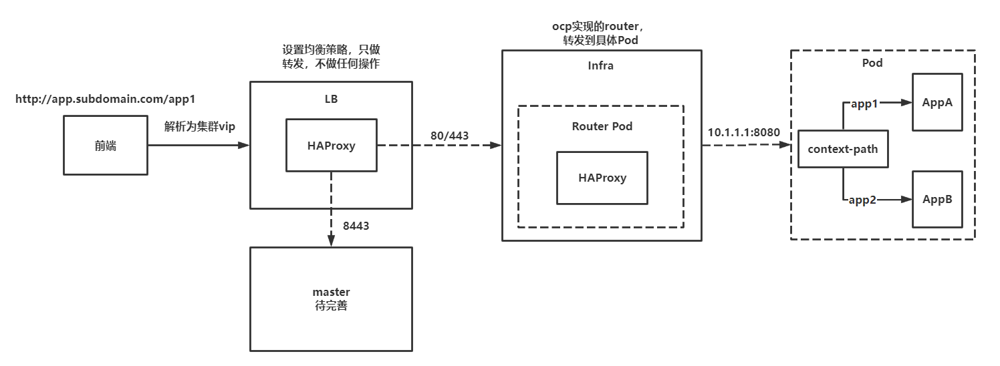

## 前提说明

`router`是部署在`infra`节点上面，并且`pod`的`pause`容器的`NetworkMode=host`，即整个`pod`内的容器都是使用宿主机的网络空间。

在`router pod`内部运行着`HAProxy`，整个`router`的负载转发策略都由`HAProxy`承担，当然这个是默认实现【其他实现未了解】。那就意味着如果要了解外部流量是如何到达`pod`的，我们就需要了解其具体的`haproxy.config`文件。

其次我们需要了解`sni`。【个人理解：当解析到同一个`ip`时，能根据请求头的Host返回不同的证书】

## haproxy.config如何生成

### reload

- 新增`route`，修改`route`，`endpoint`中`pod`发生变化，`router`的证书修改等情况会重新`reload`配置
* `list-watch`的方式实时的使用`haproxy.template`生成新的`haproxy.config`，`haproxy.template`可以用`hostpath`或者`configmap`的形式挂载。
* 在`reload`的时候`haproxy`会重新起一个新的`haproxy`进程，旧进程接着处理之前的连接，等待处理完毕才会结束进程。【个人理解：这里可能会产生的问题就是使用较多长连接，它可能就是起很多`haproxy`进程，极端情况就是每个进程只维护了一个长连接，到最后无内存可用】。
* `haproxy1.8`以上支持无缝重载

## haproxy.config配置

[haproxy.config](./config/ha.config)【这里只关注请求如何转发到`pod`】 

## 具体逻辑

### frontend

#### 80端口

1. 先做`ACL`的预检查，以及对请求头做一些修改
2. 检索`os_route_http_redirect.map`文件，判断当前请求是否强制重定向为`https`
3. 如果非强制`https`，则需要检索`os_http_be.map`文件，动态选择具体`backend`，默认`openshift_default`

#### 443端口

1. 先做`ACL`的预检查，并不会对请求头进行修改，加密的
2. 判断请求头是否支持`sni`，并且判断`req.ssl_sni`是否在`os_sni_passthrough.map`中【即`route`的`TLS Termination=passthrough`，个人理解：不会终结`TLS`直接转发给后端】，如果两个都满足则直接检索`os_tcp_be.map`，动态选择具体`backend`。
3. 如果并非两个都满足的情况下，则分两种情况处理：
   1. 支持`sni`
      1. 则转发`127.0.0.1:10444`
      2. 卸载默认（通配）证书，卸载自定义证书，自定义证书通过检索`cert_config.map`获取。【个人理解：这里对传来的数据解密，即`TSL`终结，而之所以称之为`Edge`类型的`route`，是因为就在这个“边缘”解密了，后续就是明文传输，未进入中心领域】
      3. 对请求头进行了简单处理，【个人理解：上一步数据解密了才能处理的】
      4. 检索`os_edge_reencrypt_be.map`，动态选择`backend`，默认`openshift_default`
   2. 不支持sni
      1. 使用`be_no_sni`，转发给`127.0.0.1:10443`，并且使用`send-proxy`将客户端ip穿透给后端（`fe_no_sni`）
      2. 卸载默认（通配）证书
      3. 对请求头进行了简单处理
      4. 检索`os_edge_reencrypt_be.map`，动态选择`backend`，默认`openshift_default`

### backend

#### be_http

- 这个在`os_http_be.map`，与`pod`通信不加密

#### be_edge_http

- 这个在`os_edge_reencrypt_be.map`，与`pod`通信不加密

#### be_secure

- 这个在`os_edge_reencrypt_be.map`或者`os_tcp_be.map`
- 如果是`os_tcp_be.map`则不需要重新加密直接转发
- 如果是在`os_edge_reencrypt_be.map`
  - 如果支持`sni`，则使用自定义证书进行加密，与`pod`通信加密
  - 如果不支持`sni`，则使用默认的证书进行加密，与`pod`通信加密

### 小结

- `route`类型为`passthrough`且支持`sni`的情况下，会去`os_tcp_be.map`中找对应`backend`，不会终止`TLS`，直接转发
- `route`类型为`edge`或者`reencrypt`，都会去`os_edge_reencypt_be.map`中找对应`backend`，区别在如果支持`sni`则会使用自定义的证书，否则使用默认证书，且都会进行`TLS`终结，但是`edge`就不会再加密了，`reencrypt`会重新加密

## 整体链路

    经过`haproxy`的处理，我们可以清晰的看到，一个类似`http://appA.subdomain.com/context`可以被转发到某个具体`pod`所监听的端口上面。（因为在集群内，如果未采用网络策略进行网络隔离，`pod`之间是可以互相访问的）

以`Tomcat`为例，启动`Tomcat`服务的时候需要配置`server.xml`中的`context-path`，然后我们访问的时候一定要带上这个`context-path`，这样就可以根据不同的`contxt-path`访问不同的子项目。所以我们在`route`的配置中也是需要配置对应的`context-path`以此对应`Tomcat`服务的`context-path`。

## 参考链接

* haproxy无缝重载

        [Truly Seamless Reloads with HAProxy - No More Hacks! - HAProxy Technologies](https://www.haproxy.com/blog/truly-seamless-reloads-with-haproxy-no-more-hacks/)

* haproxy map使用

        [Introduction to HAProxy Maps - HAProxy Technologies](https://www.haproxy.com/blog/introduction-to-haproxy-maps/)

* haproxy配置
  
  [HAProxy version 1.7.14 - Configuration Manual](https://cbonte.github.io/haproxy-dconv/1.7/configuration.html#4-use_backend)

* ssl卸载

        [HAProxy SSL Termination - HAProxy Technologies](https://www.haproxy.com/blog/haproxy-ssl-termination/)

* router原理

        [理解OpenShift（1）：网络之 Router 和 Route - SammyLiu - 博客园](https://www.cnblogs.com/sammyliu/p/10013461.html)

* sni

        [SNI是什么意思-windows运维-PHP中文网](https://m.php.cn/article/414043.html)
